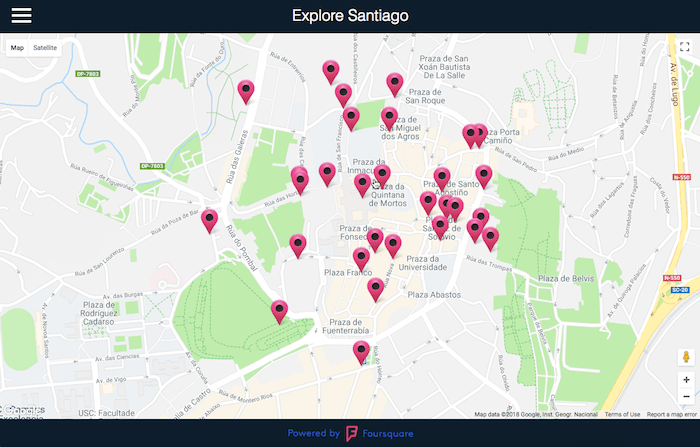

# Neighborhood Map: Explore Santiago
A single page application featuring a map of my hometown, including highlighted locations.

## Porject Overview
Explore Santiago has been built from scracth using [React](https://github.com/facebook/create-react-app). The application features a map of Santiago de Compostela and markers on the highlighted locations. The main functionalities are:

- Clicking on a map marker displays information about the location (name, photo, address and category) provided by the Foursquare API. 
- Clicking on the menu button displays a sidebar with a list of the locations and a filter with the categories available. Choosing a category, displays the filtered list of locations and the corresponging markers. 
- Clicking a location on the list displays the information about the location, and animates its associated map marker.

This project is part of the Udacity Front-End Nanodegree.

## How To Run The Application
1. Download or clone this repository.
2. From inside the new directory:
    * install all project dependencies with `npm install`
    * start the server with `npm start`
3. Visit the site in your browser at http://localhost:3000.

## Credits
- The map is provided by [Google Maps JavaScript API](https://developers.google.com/maps/documentation/javascript/tutorial).
- The information about the locations is provided by the [Foursquare API](https://developer.foursquare.com/).
- The map marker icons are from [Icons Land via Iconfinder](https://www.iconfinder.com/icons/73051/azure_base_map_marker_nounproject_outside_icon). 

## License
MIT License

Copyright (c) 2018 Lucia Gonzalez Moscoso

Permission is hereby granted, free of charge, to any person obtaining a copy of this software and associated documentation files (the "Software"), to deal in the Software without restriction, including without limitation the rights to use, copy, modify, merge, publish, distribute, sublicense, and/or sell copies of the Software, and to permit persons to whom the Software is furnished to do so, subject to the following conditions:

The above copyright notice and this permission notice shall be included in all copies or substantial portions of the Software.

THE SOFTWARE IS PROVIDED "AS IS", WITHOUT WARRANTY OF ANY KIND, EXPRESS OR IMPLIED, INCLUDING BUT NOT LIMITED TO THE WARRANTIES OF MERCHANTABILITY, FITNESS FOR A PARTICULAR PURPOSE AND NONINFRINGEMENT. IN NO EVENT SHALL THE AUTHORS OR COPYRIGHT HOLDERS BE LIABLE FOR ANY CLAIM, DAMAGES OR OTHER LIABILITY, WHETHER IN AN ACTION OF CONTRACT, TORT OR OTHERWISE, ARISING FROM, OUT OF OR IN CONNECTION WITH THE SOFTWARE OR THE USE OR OTHER DEALINGS IN THE SOFTWARE.